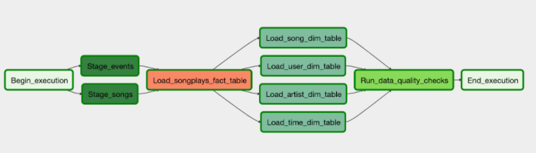

## Data Pipeline with Apache Airflow

#### Summary

This project builds an automated data pipeline that loads data from S3 to Amazon Redshift data warehouse.

#### Details

A music streaming startup, Sparkify, has a requirement to introduce more automation and monitoring to their data warehouse ETL pipelines using Apache Airflow. The source datasets resides in S3 and consists of JSON logs that tell about user activity in the application and JSON metadata about the songs the users listen to.

This project attempts to build a data pipeline that loads data from S3, process the data into anlaytics table using Spark, and load the data to a set of dimensional and fact tables in Amazon Redshift data warehouse after running data quality checks as part of the pipeline.

#### Project Structure

Below is the project structure:

- **/dags** - contains the dag file.
- **/plugins** - contains the operator and helper classes.
- **create_tables.slq** .

#### How to run

1. On the Airflow UI Admin tab select **Connections** and create **Conn Id** for **_aws_credentials_** with the correct AWS credentials.
2. On the Airflow UI Admin tab select **Connections** and create **Conn Id** for **_redshift_** with the correct PostgreSql connection credentials.
3. Execute the dag from the UI.

